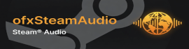

# ofxSteamAudio

**Physics-based 3D audio for openFrameworks — Steam Audio 4.8.1 (Phonon C API)**

RAII C++ wrappers covering the public Steam Audio C API, plus interactive examples that mirror Valve’s integration tests (`core/src/itest`).



## Features

| Area | Wrapper types | Steam Audio itest |
|------|---------------|-------------------|
| Context / memory | `Context` | memory, log |
| Audio buffers | `AudioBuffer` | AudioBuffer |
| HRTF | `HRTF` | HRTFDatabase |
| Binaural | `BinauralEffect` | binauraleffect |
| Panning | `PanningEffect` | panningeffect |
| Virtual surround | `VirtualSurroundEffect` | virtualsurroundeffect |
| Ambisonics | Encode / Panning / Binaural / Rotation / Decode | ambisonics* |
| Direct path | `DirectEffect` + `Simulator` | directsoundeffect, directsimulator |
| Reflections | `ReflectionEffect`, `ReflectionMixer` | parametricreverb, reverbeffect, convolutioneffect |
| Pathing | `PathEffect`, probes, bakers | pathing, probes |
| Scene | `Scene`, static / instanced mesh | scene, staticmesh, instancedmesh |
| Energy / IR | `EnergyField`, `ImpulseResponse`, `Reconstructor` | energyfield, impulseresponse |
| High-level | `Engine` | multi-source binaural demo |

Also wraps: serialization, Embree device (x86_64), distance attenuation, air absorption, directivity, relative direction.

## Layout

```
src/                    # wrappers (include ofxSteamAudio.h)
libs/steamaudio/        # headers + prebuilt libphonon (+ mysofa, pffft)
examples/
  simple-example/           # Binaural HRTF multi-source
  example-panning/          # Stereo panning
  example-ambisonics/       # Ambisonics encode → binaural
  example-virtual-surround/ # 5.1 → binaural
  example-direct/           # Occlusion + direct effect
  example-scene/            # Static + instanced meshes
  example-reflections/      # Parametric reverb
  example-pathing/          # Probe generation + path scaffolding
tests/api-tests/            # Headless coverage of all wrappers
.github/workflows/macos.yml # CI: macOS build + run tests
```

## Quick start

```cpp
#include "ofxSteamAudio.h"

ofxSteamAudio::Engine audio;

void setup() {
    audio.setup(44100, 512);
    int id = audio.addSource(glm::vec3(2, 0, 0));
    audio.setSourceFrequency(id, 220.0f);

    ofSoundStreamSettings s;
    s.numOutputChannels = 2;
    s.sampleRate = 44100;
    s.bufferSize = 512;
    s.setOutListener(this);
    soundStream.setup(s);
}

void update() {
    audio.setListener(cam);
    audio.updateSource(0, sourceWorldPos);
}

void audioOut(ofSoundBuffer& buffer) {
    audio.processAudio(buffer); // synthesizes tones + binaural spatialize
}
```

Low-level API (full control):

```cpp
ofxSteamAudio::Context ctx;
ofxSteamAudio::HRTF hrtf;
ofxSteamAudio::BinauralEffect binaural;
// ctx.setup(); hrtf.create(ctx, audioSettings); binaural.create(ctx, audioSettings, hrtf);
// binaural.apply(direction, hrtf, monoIn.get(), stereoOut.get());
```

## Building

Requires openFrameworks (tested with modern OF on macOS arm64/x86_64).

```bash
# from an example
cd examples/simple-example
make -j

# headless tests
cd tests/api-tests
make -j Release
./bin/api-tests   # or the generated app path
```

### macOS libraries

`addon_config.mk` links:

- `libphonon.a` (Steam Audio)
- `libmysofa.a` (SOFA HRTF)
- `libpffft.a` (FFT)
- `zlib`, Accelerate, AudioToolbox, CoreAudio

Embree-backed scenes are optional (x86_64 package bits); the default ray tracer works on Apple Silicon.

## CI

GitHub Actions workflow [`.github/workflows/macos.yml`](.github/workflows/macos.yml) on `macos-latest`:

1. Checkout openFrameworks + this addon  
2. Download OF libs  
3. Build OF core  
4. Build & run `tests/api-tests`  
5. Compile all examples  

## Steam Audio

- [Steam Audio GitHub](https://github.com/ValveSoftware/steam-audio)
- [C API docs](https://valvesoftware.github.io/steam-audio/doc/capi/index.html)
- Version: **4.8.1** (`STEAMAUDIO_VERSION` from `phonon_version.h`)

## License

Addon code: see `LICENSE`. Steam Audio: Apache 2.0 — see `libs/steamaudio/license/`.
